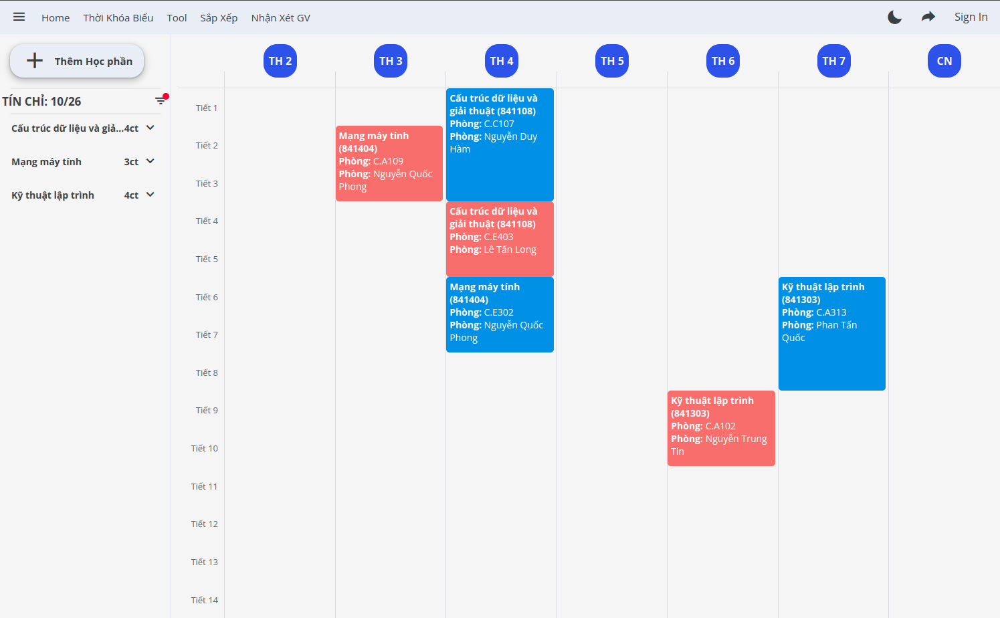

# Chuyển qua repositorie mới
https://github.com/nguyluky/TKB-SGU-UI

# Thời Khóa Biểu Sắp Xếp

đây là dự án lớn nhất được đầu tự và tốn thời gian nhất của tôi.
thông quan dự án này tôi muốn chao rồi cho mình nhiều kĩ năn cho bản thân và gáp dụng cái kĩ thuật mới và quan trong nhất là kĩ năng làm viết nhón

# Tính năng

nói đơn giản là cái này nó xẽ giúp xinh viên xắp xệp thời khóa biểu hợp lý
các tính năng nổi bật
- xắp xết thời khóa biểu
- filter theo ngày tiết giáo viên
- lưu, chia sẻ, làm chung với bạn bè của bạn
- xuất thời khóa biểu dang nhiều dạng khác nhau
  - hình ảnh
  - code javascript để gián vào 
  - nhiều người làm chung một thơi khóa biểu
- bot đăng kí

# Screenshots

